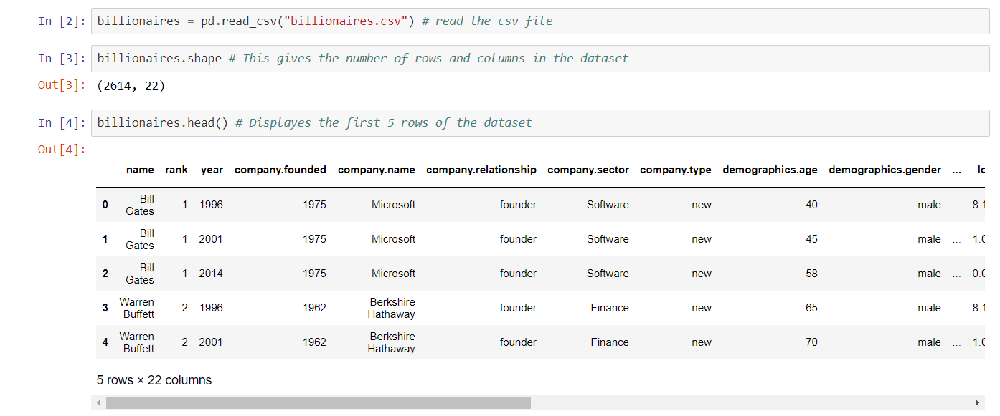
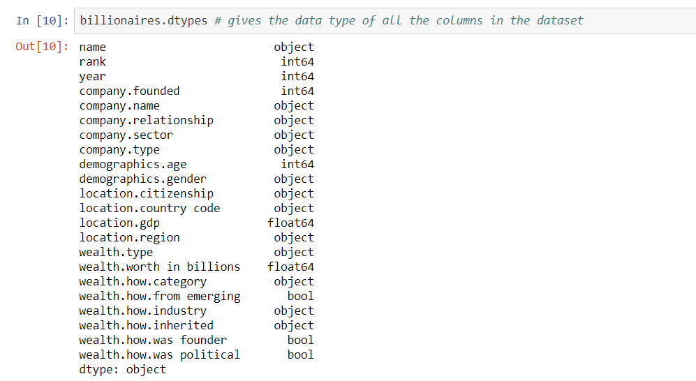
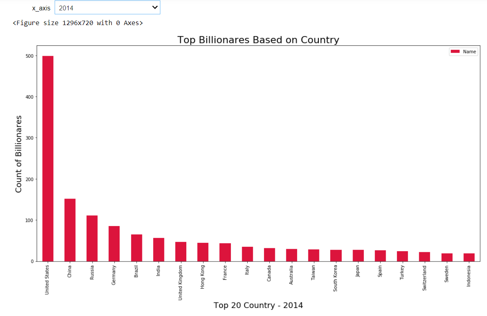
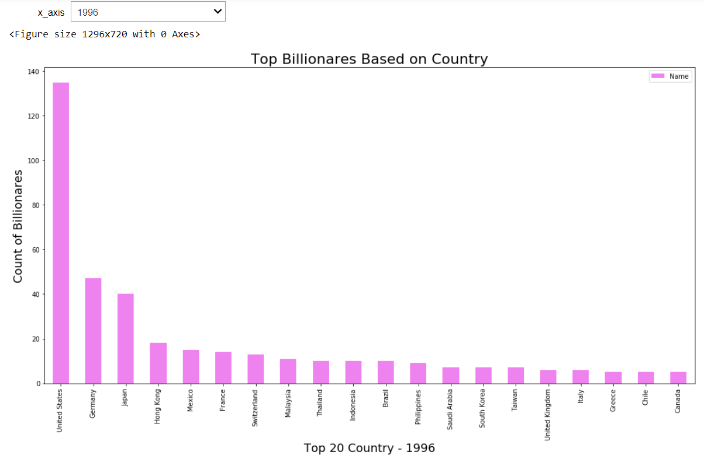

<h1>Welcome To The Billionare World: Data Visual analysis to learn some new facts about the world's richest.</h1>
<h3>Amidst the COVID-19 outbreak where people are receiving stimulus checks at one end for the daily survival, we have one sector of humanity contributing to this give and take relation. This got me thinking about should billionaires even exist?  There has been a much-heated debate on this topic in the USA and UK where Bernie Sanders says billionaires should be taxed out of existence while Joe Biden has warned against demonizing rich people.A new report suggested the world’s 2,153 billionaires have more wealth than 4.6 billion people, underscoring the degree of global inequality. <a href="https://www.oxfam.org/en/research/time-care?cid=aff_affwd_donate_id78888&awc=5991_1588560295_e499666771e54514c43d76e0fb835a3a"> (Oxfam International study) </a>. Other experimental studies showed that in 1990, the total wealth of all US billionaires was $118 billion in today's dollars. Last year, it grew to over $3 trillion. The three of today’s billionaires: Jeff Bezos, Bill Gates, and Warren Buffet inherit the wealth as the bottom half of the US households combined. On the other hand, about one-fifth of Americans have zero negative worth and about two-fifth of them don’t even have cash of $400 emergency at hand. <a href="https://www.oxfam.org/en/research/time-care?cid=aff_affwd_donate_id78888&awc=5991_1588560295_e499666771e54514c43d76e0fb835a3a"> (Federal Reserve Report) </a> </h3>
<h3>All of this got me interested in the dataset about these <a href="https://think.cs.vt.edu/corgis/csv/billionaires/">billionaires</a> compiled by few researchers at <a href="http://www.iie.com/publications/interstitial.cfm?ResearchID=2917">Peterson Institute for International Economics</a> from Forbes World’s Billionaires lists from 1996-2014.</h3>
<h3>In this digital age we have become more aware about the trends and paterns occuring in our dailylifestyle. We have visuals embedded in our daily routines so much that we forget to stop and think about how is data involded in this. For example we watch sci-fie movies displaying stat of a robot in the fide on a blue  hue screen in the air, or games score on TV giving the stats of the players and recods of the matches, smart watches monitering our pulses and displaying the data. You name it and we have it. So in this report I have tried to use such data visualization techniques to answer a few questions to crave my curiosity about the world's richest. I have included few representations which inspired my analysis and added dimension to my findings. So lets get started and find obtain some insights based on the data we have.</h3>
<h3>To begin with we load the csv files and extract the data into a dataframe. This will help us to see the number of rows and columns in the dataframe. We will check the data types of the columns, null/NaN values and futher any discrepencies present in the dataset. The link to the full working code is provided at the end of the report. I have replaced the null and negative rows in Age column with the  mean age of the column I have also changed the column names in the dataset to be more consistant.</h3>

<h3><strong>Rankings</strong></h3>
<h3>Lets begin with the Rankings in the dataset. The below graphs bifurcates the count of billionares based on the Year. For the year of 2014 the ranking in ascending order was: United States, China, Russia, Germany, Brazil and so ion. Where as In the year 1996 the ranking in the ascending order was: United States, germany, Japan, Hong Kong, Mexico and so on. This clearly shows that the count in USA over the years have been stable but China has increasing number of billionares over they years.</h3>

