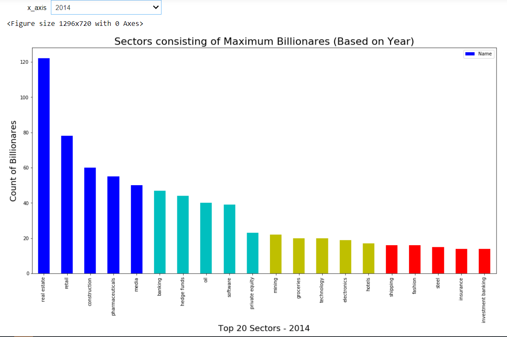
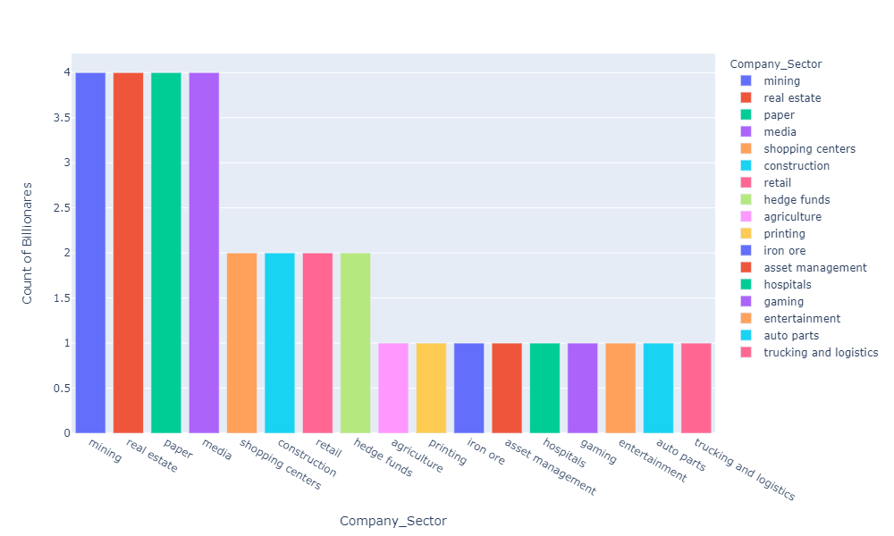
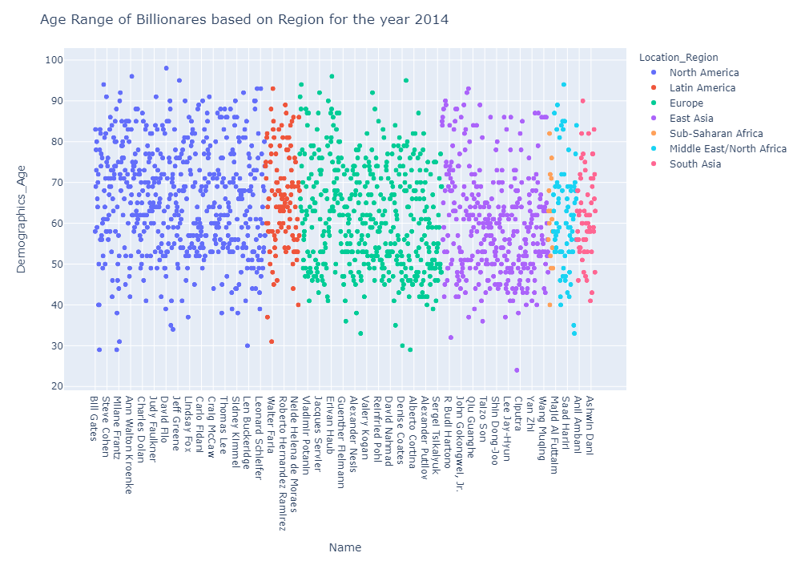
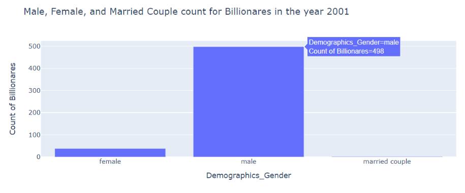
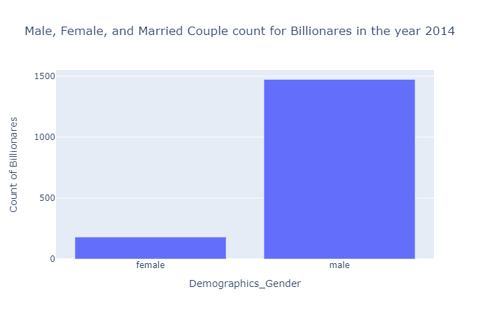
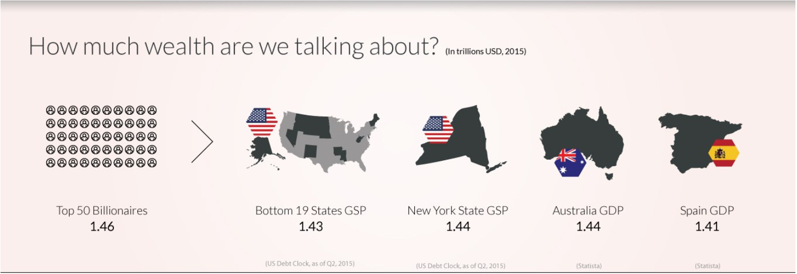

<h1>Welcome To The Billionaire World: Data Visual analysis to learn some new facts about the world's richest.</h1>

<h3>Amidst the COVID-19 outbreak where people are receiving stimulus checks at one end for the daily survival, we have one sector of humanity contributing to this give and take relation. This got me thinking about should billionaires even exist?  There has been a much-heated debate on this topic in the USA and UK where Bernie Sanders says billionaires should be taxed out of existence while Joe Biden has warned against demonizing rich people.
A new report suggested the world’s 2,153 billionaires have more wealth than 4.6 billion people, underscoring the degree of global inequality. <a href="https://www.oxfam.org/en/research/time-care?cid=aff_affwd_donate_id78888&awc=5991_1588560295_e499666771e54514c43d76e0fb835a3a"> (Oxfam International study)</a>. Other experimental studies showed that in 1990, the total wealth of all US billionaires was $118 billion in today's dollars. Last year, it grew to over $3 trillion. The three of today’s billionaires: Jeff Bezos, Bill Gates, and Warren Buffet inherit the wealth as the bottom half of the US households combined. On the other hand, about one-fifth of Americans have zero negative worth and about two-fifth of them don’t even have cash of $400 emergency at hand. <a href="https://www.oxfam.org/en/research/time-care?cid=aff_affwd_donate_id78888&awc=5991_1588560295_e499666771e54514c43d76e0fb835a3a"> (Federal Reserve Report)</a></h3>
<h3>All of this got me interested in the dataset about these <a href="https://think.cs.vt.edu/corgis/csv/billionaires/">billionaires</a> compiled by few researchers at <a href="http://www.iie.com/publications/interstitial.cfm?ResearchID=2917">Peterson Institute for International Economics</a> from Forbes World’s Billionaires lists from 1996-2014.</h3>

<h3>In this digital age we have become more aware of the trends and patterns occurring in our daily lifestyle. We have visuals embedded in our daily routines so much that we forget to stop and think about how is data involved in this. For example, we watch sci-fie movies displaying stats of a robot in the fight on a blue hue screen in the air, or games score on TV giving the stats of the players and records of the matches, smartwatches monitoring our pulses and displaying the data. You name it and we have it. So in this report, I have tried to use such data visualization techniques to answer a few questions about the world's richest. I have included a few representations which inspired my analysis and added dimension to my findings. So let's get started and obtain some insights based on the data we have.</h3>
<h3>The interactive visualizations from the data are present on this <a href="https://mybinder.org/v2/gh/nidhip2/Welcome-To-The-Billionare-World/master">link</a>.</h3>
<h3>To begin with we load the CSV files and extract the data into a data frame. This will help us to see the number of rows and columns in the data frame. We will check the data types of the columns, null/NaN values, and further any discrepancies present in the dataset. The link to the full working code is provided at the end of the report. I have replaced the null and negative rows in Age column with the  mean age of the column I have also changed the column names in the dataset to be more consistent.</h3>

<h2>Rankings</h2>
<h3> Let's begin with the Rankings in the dataset. The below graphs bifurcates the count of billionaires based on the Year. For the year 2014, the ranking in ascending order was: United States, China, Russia, Germany, Brazil, and so on. Whereas In the year 1996 the ranking in the ascending order was: United States, Germany, Japan, Hong Kong, Mexico, and so on. This clearly shows that the count in the USA over the years have been stable but China has an increasing number of billionaires over the years.</h3>

<h3>This brings the questions of which sector do they billionaires belong to. The next graph shows the sectors of the industries where the maximum number of billionaires belong. Again this changes from year to year and can be studied with the interactive graph where users can select the year for which they want the ranking. In the year 2014, the highest number of billionaires belonged to real-estate, followed by the retail sector. In the year 2001 real-estate sector did see a drop and was placed number second and media industry had the highest number of billionaires.</h3>

<h3>In my research I came across this amazing <a href="https://www.visualcapitalist.com/visualizing-worlds-top-50-wealthiest-billionaires/">visualization</a> which groups the top 50 Billionaires in the world for the year 2015 by Industry to which they belong and the amount of wealth they have. The visuals show they the Technology industry has the highest number of billionaires followed by media, diversified, Real-Estate, Retails, and so on. </h3>

<h3>Now that we have studied the ranking and the sectors to which billionaires belong we will see the total wealth cumulative of all the billionaires in a particular country. in addition to this we will see the mean age of the billionaires in that country. To make this visualization more interactive I have linked another graph that gives out the segregation of billionaires in that country based on the company sectors. For example below graphs shows the mean age and total wealth in Australia, linked to that in which sectors do these billionaires belong from highest to lowest.</h3>

<h2>Demographics and Parameters</h2>
<h3>Now coming to the demographics of the billionaires I have plotted an interactive graph based on the year, which gives the age of the billionaire and the region where they are from in color-coded format. This gives us the density where the maximum billionaires are and the age analysis. Below is the graph for the year 2014 and it depicts the following things. A significant count of billionaires in East Asia, South Asia, and the Middle East region lie in the age range of 35 to 60 yrs. Whereas in North America this age group is not that significant. For Latin America and North America, a significant amount lies in the range of 50 to 90 yrs. This can mean that to be a billionaire in American regions comes at a very later age as compared to Asian regions. There can be multiple reasons behind it: inherited wealth in Asian regions as compared to Americans, life-expectancy, etc.</h3>

<h3>Another visualization from the <a href="https://www.visualcapitalist.com/visualizing-worlds-top-50-wealthiest-billionaires/">same report</a> as above gave a very insightful fact about the age spectrum based on the industry which the billionaires belong. Here Mark Zukerberg is a billionaire at 31 and belongs to the tech industry whereas Liliane Bettencourt is at 93 yrs of age in the cosmetic industry.</h3>

<h3>This brings us to the gender aspect of the analysis. The below graphs gives the count of male and female billionaires over the years. But as we see even though the count of female billionaires have increased the gender gap remains.</h3>

<h2>Conclusion</h2>
<h3>The main aim of this research was to perform data analysis, data segregation, data cleaning, and data visualizations on the dataset and build meaningful relationships between the parameters to answer some questions. We learned to use various libraries in python using this analysis. There is no limit to the visuals that can be used to infer complex knowledge from this data by simple and beautiful patterns. Patterns that fall in place once we open and explore the data around us. Just like the debate of "weather rich should exist" is unending, the inferences to be taken away from this data are infinite. I say this because this data is dynamic and will keep on changing over the years. So let keep on questioning new things to learn more things.</h3>
<h3>I hope this article inspires you or helped you catch a glimpse in the world of data visualizations. At the beginning of this article, I mentioned some numbers which you might have forgotten till now as that was mere text comparing the world’s 2,153 billionaires have more wealth than 4.6 billion people. Well below is a visual which describes a similar fact. Which one do you think makes a bigger impact?</h3>

<h2>References</h2>
<ul class="task-list">
<li><a href="https://www.bloomberg.com/news/articles/2020-01-20/2-153-billionaires-are-richer-than-60-of-the-world-says-oxfam">https://www.bloomberg.com/news/articles/2020-01-20/2-153-billionaires-are-richer-than-60-of-the-world-says-oxfam</li>
<li><a href="https://time.com/5768346/billionaires-wealth/">https://time.com/5768346/billionaires-wealth/</li>
<li><a href="https://www.theguardian.com/commentisfree/2019/nov/06/billionaires-super-rich-extreme-wealth-political-influence-inequality-gates-bezos-buffett">https://www.theguardian.com/commentisfree/2019/nov/06/billionaires-super-rich-extreme-wealth-political-influence-inequality-gates-bezos-buffett</li>
<li><a href="https://www.import.io/post/what-is-data-visualization/">https://www.import.io/post/what-is-data-visualization/</li>
<li><a href="https://medium.com/@powusu381/a-complete-data-analysis-walk-through-with-pythons-pandas-matplotlib-and-seaborn-2df9f6a3035b">https://medium.com/@powusu381/a-complete-data-analysis-walk-through-with-pythons-pandas-matplotlib-and-seaborn-2df9f6a3035b</li>
<li><a href="https://ips-dc.org/report-billionaire-bonanza-2017/">https://ips-dc.org/report-billionaire-bonanza-2017/</li>
<li><a href="https://www.federalreserve.gov/publications/files/2018-report-economic-well-being-us-households-201905.pdf">https://www.federalreserve.gov/publications/files/2018-report-economic-well-being-us-households-201905.pdf</li>
<li><a href="https://www.cnn.com/2020/02/24/perspectives/billionaire-wealth-taxes/index.html">https://www.cnn.com/2020/02/24/perspectives/billionaire-wealth-taxes/index.html</li>
<li><a href="https://knoema.com/onondkd/forbes-2016-world-s-billionaires-list">https://knoema.com/onondkd/forbes-2016-world-s-billionaires-list</li>
<li><a href="https://howmuch.net/articles/richest-billionaires-by-country-2019">https://howmuch.net/articles/richest-billionaires-by-country-2019</li>
<li><a href="https://www.forbes.com/billionaires/">https://www.forbes.com/billionaires/</li>
<li><a href="https://plotly.com/python/plotly-fundamentals/">https://plotly.com/python/plotly-fundamentals/</li>
<li><a href="https://boingboing.net/2019/11/22/visualizing-just-how-stupidly.html">https://boingboing.net/2019/11/22/visualizing-just-how-stupidly.html</li>
<li><a href="http://www.iie.com/publications/interstitial.cfm?ResearchID=2917">http://www.iie.com/publications/interstitial.cfm?ResearchID=2917</li>
<li><a href="https://www.piie.com/publications/working-papers/origins-superrich-billionaire-characteristics-database">https://www.piie.com/publications/working-papers/origins-superrich-billionaire-characteristics-database</li>
</ul>
